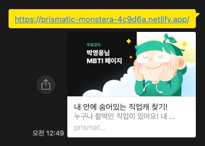

[](https://app.netlify.com/sites/prismatic-monstera-4c9d6a/deploys)

# 내 안에 숨어있는 직업캐 찾기!

<a href="https://prismatic-monstera-4c9d6a.netlify.app/" target="_blank">데모 보기</a> 


## 기본 리소드 다운로드 

강의 예제에서 사용하는 이미지와 데이터 파일 등을 [다운로드](./assets.zip) 하세요!


## Favicon(파비콘, favorites icon)

웹페이지를 나타내는 아이콘, 웹페이지의 로고를 설정합니다.<br>
루트 경로에 `favicon.ico` 파일이 있으면 자동으로 로딩하기 때문에 `<link>` 를 따로 작성할 필요가 없지만,  
만약 `favicon.png` 파일을 사용하려면 다음과 같이 `<link>`를 작성할 수 있습니다.

```html
<link rel="icon" href="./favicon.png" />
```

- `favicon.ico` 64 x 64 (px) 또는 32 x 32 또는 16 x 16
- `favicon.png` 500 x 500 (px)


## Reset.css

각 브라우저의 기본 스타일을 초기화합니다.

```html
<link rel="stylesheet" href="https://cdn.jsdelivr.net/npm/reset-css@5.0.1/reset.min.css" />
```

## Web Fonts

페이지에서 사용할 [Pretendard](https://github.com/orioncactus/pretendard) 폰트를 가져오도록 지정합니다.

```html
<link rel="stylesheet" as="style" crossorigin href="https://cdn.jsdelivr.net/gh/orioncactus/pretendard@v1.3.6/dist/web/variable/pretendardvariable-dynamic-subset.css" />
```

페이지에 폰트를 적용합니다.

```css
body {
  font-family: "Pretendard Variable";
}
```

## 오픈 그래프와 트위터 카드

The Open Graph protocol & Twitter Cards  
웹페이지가 소셜 미디어(페이스북, 트위터 등)로 공유될 때 우선적으로 활용되는 정보를 지정합니다.

  


```html
<!-- Open Graph -->
<meta property="og:type" content="website" />
<meta property="og:site_name" content="내숨캐" />
<meta property="og:title" content="내 안에 숨어있는 직업캐 찾기!" />
<meta property="og:description" content="누구나 찰떡인 직업이 있어요! 내 안에 숨어있는 직업캐를 찾아보세요!" />
<meta property="og:image" content="/images/thumbnail.jpg" />
<meta property="og:url" content="https://prismatic-monstera-4c9d6a.netlify.app/" />

<!-- Twitter Cards -->
<meta property="twitter:card" content="summary" />
<meta property="twitter:site" content="내숨캐" />
<meta property="twitter:title" content="내 안에 숨어있는 직업캐 찾기!" />
<meta property="twitter:description" content="누구나 찰떡인 직업이 있어요! 내 안에 숨어있는 직업캐를 찾아보세요!" />
<meta property="twitter:image" content="/images/thumbnail.jpg" />
<meta property="twitter:url" content="https://prismatic-monstera-4c9d6a.netlify.app/" />
```

[더 많은 오픈 그래프 속성 보기](https://ogp.me/)

- `og:type`: 페이지의 유형(E.g, `website`, `video.movie`)
- `og:site_name`: 속한 사이트의 이름
- `og:title`: 페이지의 이름(제목)
- `og:description`: 페이지의 간단한 설명
- `og:image`: 페이지의 대표 이미지 주소(URL)
- `og:url`: 페이지 주소(URL)

[더 많은 트위터 카드 보기](https://developer.twitter.com/en/docs/twitter-for-websites/cards/guides/getting-started)

- `twitter:card`: 페이지(카드)의 유형(E.g. `summary`, `player`)
- `twitter:site`: 속한 사이트의 이름
- `twitter:title`: 페이지의 이름(제목)
- `twitter:description`: 페이지의 간단한 설명
- `twitter:image`: 페이지의 대표 이미지 주소(URL)
- `twitter:url`: 페이지 주소(URL)


